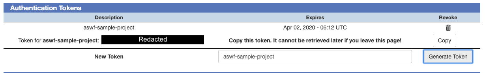

<!-- SPDX-License-Identifier: CC-BY-4.0 -->
<!-- Copyright Contributors to the ASWF Sample Project -->

# ASWF Sample Project

[](LICENSE)
[](https://dev.azure.com/panisset0719/aswf-sample-project/_build/latest?definitionId=12&branchName=master)
[](https://sonarcloud.io/dashboard?id=imageworks_OpenColorIO)
[](https://bestpractices.coreinfrastructure.org/projects/2612)

The purpose of this project is to provide a skeleton or sample Academy Software Foundation (ASWF) project reflecting the best practices that have been established by the Technical Advisory Committee (TAC). More detailed documentation can be found in the [Technical Advisory Committee repository](https://github.com/AcademySoftwareFoundation/tac).

## Project Mission Statement

The project should have a clearly defined mission statement, which should be labeled as such. The mission statement should be located near the top of the README.md file in the home directory of the project repository, as well as on the home page of the project web site. Projects can use their mission statement to help define what their project does, what problems it solves, what is outside the scope of the project, and what are the long term goals. This Linux Foundation blog post [Why and How to Set an Open Source Strategy](https://www.linuxfoundation.org/blog/2017/11/set-open-source-strategy/) shares some ideas as to what a mission statement for an open source project can look like.

A simple mission statement for this ASWF Sample Project could be:

>The ASWF Sample Project aims to capture and document the best practices that will help open source projects meet the requirements for ASWF acceptance to Incubation Stage, followed by project graduation to Adopted Stage. By encouraging and documenting common practices and infrastructure between ASWF projects, the ASWF Sample Project should help to avoid duplicated effort and facilitate contributing to multiple ASWF projects.

## Project Submission and Graduation

The process for submitting a project for ASWF membership is documented in the [Project Contribution Proposal Template](https://github.com/AcademySoftwareFoundation/tac/blob/master/process/proposal_template.md). Once a project has been accepted as an Incubation Stage project, the next step is to move the project towards the Adopted Stage, as documented in the [Project Lifecycle Document](https://github.com/AcademySoftwareFoundation/tac/blob/master/process/lifecycle.md). A major part of the Project Graduation requirements are covered by meeting the "passing" [criteria for the Best Practices badge](https://github.com/coreinfrastructure/best-practices-badge/blob/master/doc/criteria.md) defined by the [Linux Foundation's Core Infrastructure Initiative (CII)](https://bestpractices.coreinfrastructure.org/en).

A lot of the information and files in this sample project are closely related to the CII badge requirements, or demonstrate the preferred way to implement these requirements in a ASWF project.

## Source Code Repository

ASWF projects are hosted on [GitHub](https://github.com). Once a project has been been accepted as an Incubation Stage project, its repository will be moved under the [Academy Software Foundation organization](https://github.com/AcademySoftwareFoundation) which is managed by the Linux Foundation Release Engineering team.

## Licensing

ASWF projects should chose an explicit [Open Source Initiative](https://opensource.org/licenses) approved open source license, you can use the [Choose a License](https://choosealicense.com/) site to help pick one. Existing projects will typically want to stick to their existing license, as relicensing can be a complex process. It is preferable to select an existing, unmodified, standard open source license since this simplifies the process of getting legal approval for use of the project within commercial organizations, and allows the use of metadata to identify the project license.

If you are starting a new project, the ASWF recommends the use of the [Apache License 2.0](https://opensource.org/licenses/Apache-2.0) for code assets, the [Creative Commons Attribution 4.0 International License](http://creativecommons.org/licenses/by/4.0/) for non-code / documentation assets, and a [Community Data License Agreement](https://cdla.io/) for datasets.

A copy of the license should be in the root directory of your repository and should be called LICENSE. If you are using a standard open source license you should also tag your GitHub project with that license type. This can be done at project creation time.

Source files in your project should use [Software Package Data eXchange (SPDX)](https://spdx.org/) identifiers to specify the project license, for instance in a C++ file:

```c++
// SPDX-License-Identifier: Apache-2.0
// Copyright Contributors to the PROJECT Project.
```

More details about the the licensing and contribution requirements for ASWF projects can be found in [contributing.md in the ASWF TAC repository](https://github.com/AcademySoftwareFoundation/tac/blob/master/process/contributing.md).

## Contributor License Agreement (CLA)

A Contributor License Agreement is a requirement that an individual or company must submit a legal document before a submission can be accepted by the project. This is typically the case when a project starts outside the ASWF and the initial project corporate sponsor enforces this requirement. The ASWF OpenColorIO project documents their [CLA Requirement](https://github.com/AcademySoftwareFoundation/OpenColorIO/blob/master/CONTRIBUTING.md#contributor-license-agreements) and uses the [EasyCLA](https://corporate.lfcla.com/) system to keep a record of signed CLA agreements, as well as verify that commits to the project come from contributors who have signed these agreements. If an ASWF project requires the use of CLAs, it is encouraged to use this system.

## Developer Certificate of Origin (DCO)

The Developer Certificate of Origin (DCO) is a lighter weight approach that allows a contributor to state that the code being submitted originated from the developer, or that the developer has the permission to submit the code. Typically the developer needs to use the `git commit -s` option to sign all commits with their email address. The [DCO GitHub app](https://github.com/apps/dco) should be added to the GitHub project to verify that all pull requests meet the requirement that the commits they include should be signed.

## Project Naming Considerations

GitHub allows your project repository name to use letters [a-z], numbers [0-9], hyphens or underscores. But [RFC 952](https://tools.ietf.org/html/rfc952) and [RFC 1123](https://tools.ietf.org/html/rfc1123) specify that hostnames can only use letters, numbers and hyphens (ignoring for now internationalized domain names). Since it may be desirable to have network resources refer to the project name (such as the name of the project website), it is thus preferable to avoid using underscore characters in a project name.

## Project Logo

If the project has a custom logo, consider providing a vector version of your logo in the repository, preferably in the [Scalable Vector Graphics (SVG)](https://www.w3.org/Graphics/SVG/) format. A vector logo is much more flexible than one which has been rasterized to a fixed resolution image file format such as [Portable Network Graphics (PNG)](https://www.w3.org/TR/PNG/). The [ASWF Landscape](https://landscape.aswf.io) uses SVG logos to represent notable open source projects in the industry. Projects hosted by the ASWF can leverage Linux Foundation Creative Services for developing a logo for the project.

## Basic Documentation

Your project should have a README.md file in the project home directory, identifying the project and providing enough information to orient new users towards information and resources relevant to the project. The prefered format for in-tree documentation files which are likely to be viewed via the GitHub web interface is [Markdown text](https://guides.github.com/features/mastering-markdown/).

## Project Charter and Technical Steering Committee Documentation

ASWF Projects are required to designate a Technical Steering Committee (TSC) which is responsible for the technical oversight of the project, and adopt a Project Charter, for which [a template is provided in the ASWF TAC repository](https://github.com/AcademySoftwareFoundation/tac/blob/master/process/charter_template.md). The TSC should meet regularly, and should keep public meeting minutes in the project repository. The TSC is responsible for setting the design, development, testing, release and support procedures for the project in close collaboration with the project community: close collaboration and alignment of processes between the TSCs of the various ASWF projects is encouraged but not mandatory.

A suggested directory structure for the TSC-related documents based on the OpenVDB project is the following:

```
project
├── LICENSE
├── README.md
└── tsc
    ├── charter.md
    ├── meetings
    │   └── yyyy-mm-dd.md
    └── process
        ├── codereview.md
        ├── deprecation.md
        ├── release.md
        └── security.md
```

## Versioning and Releases

The project must specify a versioning mechanism, and it is suggested that [Semantic Versioning](http://semver.org/) be used for consistency with other ASWF projects. The procedure for tagging and creating a release should be documented and should be automated as much as possible. In this sample project this is documented in [tsc/process/release.md](https://github.com/jfpanisset/aswf-sample-project/blob/master/tsc/process/release.md).

## Security and Reporting Mechanism

## Maintainers List and Code Ownership

The project should include an up to date list of key contributors. This could take an ad hoc form such as the [OpenColorIO COMMITTERS.md file](https://github.com/AcademySoftwareFoundation/OpenColorIO/blob/master/COMMITTERS.md), and/or leverage the [GitHub CODEOWNERS mechanism](https://help.github.com/en/articles/about-code-owners) such as in the [OpenVDB CODEOWNERS file](https://github.com/AcademySoftwareFoundation/openvdb/blob/master/CODEOWNERS) which allows code review of pull requests to be automatically requested from owners of modified code.


## Project Website

Consider hosting project web site from GitHub repository, as this keeps all project-related content in a single repository and can help keep web site updates in sync with project updates. GitHub provides [simple web hosting](https://pages.github.com/) support which can be enabled in the GitHub Pages section of the [GitHub Project Settings](https://github.com/jfpanisset/aswf-sample-project/settings). For this sample project a stub [index.md](https://github.com/jfpanisset/aswf-sample-project/tree/master/docs) file was created in the `docs/` directory, and the project web site can be accessed at https://jfpanisset.github.io/aswf-sample-project/ (custom project DNS domain are supported and encouraged). GitHub Pages support HTTPS access, and the [Enforce HTTPS](https://help.github.com/en/articles/securing-your-github-pages-site-with-https) setting should be used to redirect HTTP access to HTTPS.

Projects with more extensive website requirements may wish to use a separate GitHub repository to maintain their assets, and can make use of different site infrastructure.

## VFX Reference Platform and Docker Containers

The [VFX Reference Platform](http://vfxplatform.com/) is a set of tool and library versions to be used as a common target platform for building software for the VFX industry. It is updated on an annual basis. ASWF projects are typically used in software environments that adhere to the VFX Reference Platforms, and will often run inside applications (in house or commercial) that are built according to the specification. ASWF projects should have a statement as to which versions of the VFX Reference Platform are supported, and should include those versions of the platform in their build and test environments.

The [aswf-docker](https://github.com/AcademySoftwareFoundation/aswf-docker) project provides an environment to build Docker containers that can be used to build and test projects in a VFX Reference Platform compliant environment. It generates Docker containers which are published to the [aswf Docker hub repository](https://hub.docker.com/u/aswf).

Azure Pipelines supports [building inside Docker containers](https://docs.microsoft.com/en-us/azure/devops/pipelines/process/container-phases?view=azure-devops&tabs=yaml) on Linux and Windows. Building inside a container insulates the build from the software environment of the build agent and allows complete control over the toolchain and dependencies. ASWF projects are encouraged to make use of the ASWF build containers as much as possible when setting up their CI environment. Containers are not supported on the macOS platform: Azure Pipelines documents the current versions of packages pre-installed on [macOS 10.13](https://github.com/microsoft/azure-pipelines-image-generation/blob/master/images/macos/macos-10.13-Readme.md) and [macOS 10.14](https://github.com/microsoft/azure-pipelines-image-generation/blob/master/images/macos/macos-10.14-Readme.md) build agents: projects can use pre-installed package management systems such as [Homebrew](https://brew.sh/) or [Miniconda](https://docs.conda.io/projects/conda/en/latest/) to manage dependencies on that platform.

## Build Tools

ASWF projects typically use [CMake](https://cmake.org/) as a build tool to help support multiple platforms and leverage CMake modules that help with resolving the dependencies on packages and libraries used by projects. A useful resource for in depth CMake information is the book [Professional CMake: A Practical Guide](https://crascit.com/professional-cmake/) by Craig Scott.

CMake can also be used to run the project test suite with [CTest](https://gitlab.kitware.com/cmake/community/wikis/doc/ctest/Testing-With-CTest), and can send test suite results to the [`CDash`](https://www.cdash.org/) dashboard.

[CPack](https://gitlab.kitware.com/cmake/community/wikis/doc/cpack/Packaging-With-CPack) can be used to generate installation packages in a variety of generic and OS-specific package formats such as `.rpm`, `.deb` or `.tar.gz` for Linux, `.msi` or `.zip` for Windows, `.dmg` or `.dmg` for macOS.

## Continuous Integration With Azure DevOps / Azure Pipeline

ASWF projects currently use Azure Pipelines from Microsoft (a component of the Azure DevOps service) to provide cross platform Continuous Integration functionality. Azure Pipelines provides Windows, macOS and Linux build agents free of charge for open source projects, and although GPU equiped build agents for running test suites that require GPU acceleration are not currently available, it is possible to add a custom build agent to the Agent Pool for your project.

The free build agents provided by Microsoft are documented under [Microsoft-hosted agents](https://docs.microsoft.com/en-us/azure/devops/pipelines/agents/hosted?view=azure-devops) and are configured with a significant amount of pre-installed software (see links to specific agents in the documentation for a list of available packages). Typically ASWF projects will want to control specific versions of tools and libraries used to build and test, additional mechanisms such as Containers and package managers can be used to configure the desired build environment.

Azure Pipelines typically looks for a file called `azure-pipelines.yml` in the root directory of the GitHub project which specifies build / test / release instructions to be executed by CI pipeline.

### Initial Configuration

Once a project becomes an official ASWF project and moves its repository under the [AcademySoftwareFoundation GitHub organization](https://github.com/AcademySoftwareFoundation), it will be using the [ASWF Azure Pipelines build project](https://dev.azure.com/academysoftwarefoundation/Academy%20Software%20Foundation/) which is managed by the Linux Foundation Release Engineering team. But you will first want to get Azure Pipelines builds for your project running under your own login.

### GitHub and Azure DevOps UI Configuration

To run a build of your GitHub project using Azure Pipelines, you will first need to create an Azure DevOps account (assuming you don't already have one, and assuming you already have a GitHub account) and configure authentication in Azure DevOps and GitHub, which can only be done from the web interface:

1. You can [login to Azure DevOps](https://docs.microsoft.com/en-us/azure/devops/user-guide/sign-up-invite-teammates) either with a Microsoft account or with your GitHub credentials. You can create a [Microsoft Account](https://account.microsoft.com/) if you don't already have one and [login to Azure DevOps](https://azure.microsoft.com/en-us/services/devops/) using those credentials, or alternatively use "Start free with GitHub". This will create a default Azure DevOps organization based on your username.
2. At the upper right corner of the Azure DevOps screen, click on the icon representing your account and select "Azure DevOps Profile". Under "User Settings -> Security" select "Personal Access Token". Select "+ New Token" to create a new token, name it "cli_access", under the "Organization" drop down select "All Accessible Organizations", and under "Scope" select "Full Access". Click on "Create" to create the token, make sure to record the value of the token in a safe place. This process is documented under [Authenticate access with personal access tokens](https://docs.microsoft.com/en-us/azure/devops/organizations/accounts/use-personal-access-tokens-to-authenticate). This Personal Access Token (PAT) will let you authenticate CLI access to Azure DevOps.
3. Similarly you will need to create a [GitHub Personal Access Token](https://help.github.com/en/articles/creating-a-personal-access-token-for-the-command-line) to allow Azure DevOps to connect to your GitHub project. As per the [Build GitHub Repositories](https://docs.microsoft.com/en-us/azure/devops/pipelines/repos/github?view=azure-devops&tabs=yaml) documentation under the section "Using a PAT", your GitHub PAT should have `repo`, `admin:repo_hook`, `read:user`, and `user:email` permissions. You can call the PAT "AzureDevOpsPAT" for instance. As with the Azure DevOps PAT make sure to record this token safely.

### Azure DevOps CLI Configuration

From this point on we will configure Azure DevOps from the CLI as much as possible. For more general documentation see [Azure DevOps CLI](https://docs.microsoft.com/en-us/azure/devops/cli/?view=azure-devops#how-to-guides). Each section is assumed to depend on the previous one to avoid repeating commands such as setting environment variables. The syntax is for `bash`, but the `az` command line tool works similarly on Windows.

1. [Install the Azure CLI on your local system](https://docs.microsoft.com/en-us/cli/azure/install-azure-cli):

   * On [Windows](https://docs.microsoft.com/en-us/cli/azure/install-azure-cli-windows) using a MSI installer
   * On [macOS](https://docs.microsoft.com/en-us/cli/azure/install-azure-cli-macos) using the [Homebrew package manager](https://brew.sh/)
   * On Linux using [`apt` for Debian/Ubuntu](https://docs.microsoft.com/en-us/cli/azure/install-azure-cli-apt) or [`yum` for RHEL/Fedora/CentOS](https://docs.microsoft.com/en-us/cli/azure/install-azure-cli-yum)

2. Install the Azure DevOps extension for the Azure CLI:

```bash
    az extension add --name azure-devops
```

3. Create an Azure DevOps project, the name doesn't matter too much, but it would probably help if it matched the name of your GitHub repository. The `AZURE_DEVOPS_EXT_PAT` environment variable is used to provide the Azure DevOps PAT you previously generated to the command line tools.

```bash
    export AZURE_DEVOPS_EXT_PAT=YOUR_AZDEVOPS_PAT
    az devops configure --defaults organization=https://dev.azure.com/AZDEVOPS_ORG_NAME
    az devops project create --name AZDEVOPS_PROJECT_NAME --source-control git --visibility public
    az devops configure --defaults project=AZDEVOPS_PROJECT_NAME
```

4. Create a Service Connection which will link your Azure DevOps project to your GitHub account, using both your Azure DevOps PAT and your GitHub PAT for authentication.

```bash
    export AZURE_DEVOPS_EXT_GITHUB_PAT=YOUR_GITHUB_PAT
    az devops service-endpoint github create --github-url https://github.com/GITHUB_ACCOUNT/GITHUB_PROJECT/settings --name GITHUB_PROJECT.connection
```

5. Create a Pipeline which will link the Azure DevOps project to your GitHub project. This assumes the existence of a `azure-pipelines.yml` configuration file in the root directory of the GitHub project. The `--branch master` command line option specifies that the build pipeline will be triggered by any commits to the `master` branch in the GitHub repository. You first need to retrieve the ID for the service connection you just created and use that to create the build pipeline:

```bash
    export CONNECTION_ID=$(az devops service-endpoint list  --query "[?name=='GITHUB_PROJECT.connection'].id" -o tsv)
    az pipelines create --name GITHUB_PROJECT.ci --repository GITHUB_USER/GITHUB_PROJECT --branch master --repository-type github --service-connection $CONNECTION_ID --skip-first-run --yml-path /azure-pipelines.yml
```

### Control Azure DevOps from Python

As an alternative to the Azure CLI, the [Azure DevOps Python API](https://github.com/Microsoft/azure-devops-python-api) can be accessed directly to automate Azure DevOps tasks.

### Launching Builds

The configuration from the previous section should have created a pipeline called `GITHUB_PROJECT.ci`, which by default compiles and runs a small C++ test program on Windows, macOS and Linux. The `--skip-first-run` command line option prevented a build from getting kicked off when the pipeline was created, but any commits to the `master` branch in the GitHub repository will kick off an automatic build, which you can monitor in the Azure DevOps web interface.

You can launch a build manually from the command line:

```bash
    export AZURE_DEVOPS_EXT_PAT=YOUR_AZDEVOPS_PAT
    az pipelines build queue --definition-name GITHUB_PROJECT.ci
```

## Automated Test Suite

To meet the CII badge requirements, the project must have an automated test suite, and must have a policy that new tests must be added to the test suite when major new functionality is added to the project. There are several tools that can help create, run and monitor the results of a test suite, this sample project demonstrates trivially simple testing using [CTest](https://gitlab.kitware.com/cmake/community/wikis/doc/ctest/Testing-With-CTest) with uploading of test results to [CDash](https://my.cdash.org/index.php?project=aswf-sample-project).

### Testing with CTest

In this simple example the tests are specified in [src/CMakeLists.txt](src/CMakeLists.txt). One test just runs the resulting binary to make sure it doesn't crash on startup, one test looks for the expected `Hello, world!` output.

```bash
# does the application run
add_test (HelloRuns hello)
# does it print what you expect
add_test (HelloPrints hello)
set_tests_properties (HelloPrints PROPERTIES PASS_REGULAR_EXPRESSION "Hello, World!")
```

The test suite can be run directly from the `build` directory:

```bash
cd build
ctest .
```

which should answer something like:

```bash
Test project /path/to/build/directory
    Start 1: HelloRuns
1/2 Test #1: HelloRuns ........................   Passed    0.01 sec
    Start 2: HelloPrints
2/2 Test #2: HelloPrints ......................   Passed    0.00 sec

100% tests passed, 0 tests failed out of 2

Total Test time (real) =   0.01 sec
```

### Uploading CTest results to CDash

[CDash](https://www.cdash.org/) is an open source web-based testing server developer by [Kitware](https://www.kitware.com/), who are also responsible for CMake. CTest has integration with CDash and can automatically upload test suite results to CDash for display and analysis.

First, create a free account on [my.cdash.org](https://my.cdash.org) then once you are logged in, scroll to the bottom of the browser window to the Administration section and select "Start a new project". Use the name of your GitHub project as the CDash project name, select:

* [x] Public Dashboard
* [x] Authenticate Submission

and save your changes with "Update Project".


Next create an authentication token for this CDash project which will be used by CTest to authenticate uploads of test results. Name this token the same as your GitHub / CDash project, create the token, and copy it to a safe location since you will not be able to access it again from the CDash interface.



Then add the CDash token that was created as a secret variable called `CTEST_CDASH_AUTH_TOKEN` in the Azure Pipelines pipeline definition (assuming you named your pipeline `GITHUB_PROJECT.ci` as per the section on Azure DevOps CLI configuration). 

```bash
export AZURE_DEVOPS_EXT_PAT=YOUR_AZDEVOPS_PAT
az pipelines variable create --name CTEST_CDASH_AUTH_TOKEN --value YOUR_CDASH_TOKEN --secret true --allow-override true --pipeline-name GITHUB_PROJECT.ci 
```

By default [secrets associated with a build pipeline are not made available to pull request builds of forks](https://docs.microsoft.com/en-us/azure/devops/pipelines/repos/github?view=azure-devops&tabs=yaml#validate-contributions-from-forks) which will cause automatic gating test builds for Pull Requests to fail since these are built from a separate fork.

Unfortunately there is currently [no simple way to allow secrets access from fork builds via the Azure CLI](https://github.com/Azure/azure-devops-cli-extension/issues/836), so instead you need to follow these steps in the GUI:

- In the sidebar of your Azure DevOps project, select `Pipelines / Pipelines`
- Select the build pipeline, called GITHUB_PROJECT.ci
- Click on the Edit button at the top right corner of the screen
- Select the `...` drop down menu and pick the `Triggers` option
- Select the `Pull request validation` trigger
- Tick the `Make secrets available to builds of forks` option
- Click on the `Save & queue` drop down menu, select `Save`

Allowing fork builds access to secrets can be considered a security issue, since the fork / PR could be adding code to compromise the secret. An alternative approach is to skip sections of the build that require access to secrets stored in environment variables, and whenever possible use Service Connections instead. In this project conditional code in [CTestScript.cmake](https://github.com/jfpanisset/aswf-sample-project/blob/master/CTestScript.cmake) is used to prevent trying to upload test results if the access token environment variable is not set.

The configuration to allow CTest to upload to CDash is found in the files [`CTestConfig.cmake`](CTestConfig.cmake) and the CTest script that will get run is in [`CTestScript.cmake`](CTestConfig.cmake).

The CI pipeline definition YAML file [azure-pipelines.yml](azure-pipelines.yml) must define the following environment variables before it can call CTest:

* `CTEST_SOURCE_DIRECTORY`: the path to the current location of the project on the build agent
* `CTEST_BUILD_NAME` : an identifier for the current build
* `CTEST_SITE` : an identifier for the build agent

After the build is complete, the build agents should then execute:

```bash
ctest --verbose -S ../CTestScript.cmake
```

to run the CTest script, and you should then be able to view the [test results on the CDash dashboard](https://my.cdash.org/index.php?project=aswf-sample-project):


## Static Analysis

SonarCloud, but lots of other options such as [Clang-Tidy](https://clang.llvm.org/extra/clang-tidy/), [Cppcheck](http://cppcheck.sourceforge.net/), [Infer](https://fbinfer.com/), [LGTM](https://lgtm.com/), [PVS-Studio](https://www.viva64.com/en/pvs-studio/).

## Ticketing System

The ASWF provides an instance of the [JIRA ticketing system](https://jira.aswf.io/secure/Dashboard.jspa) for the use of its member projects. You will need to create a [Linux Foundation ID](https://identity.linuxfoundation.org/) to use this system. The native GitHub Issues mechanism in the project GitHub repository is also available. The TSC should define and document which ticketing system (or combination thereof) should be used and for what purpose.

## Release Notes

## Project Badges
